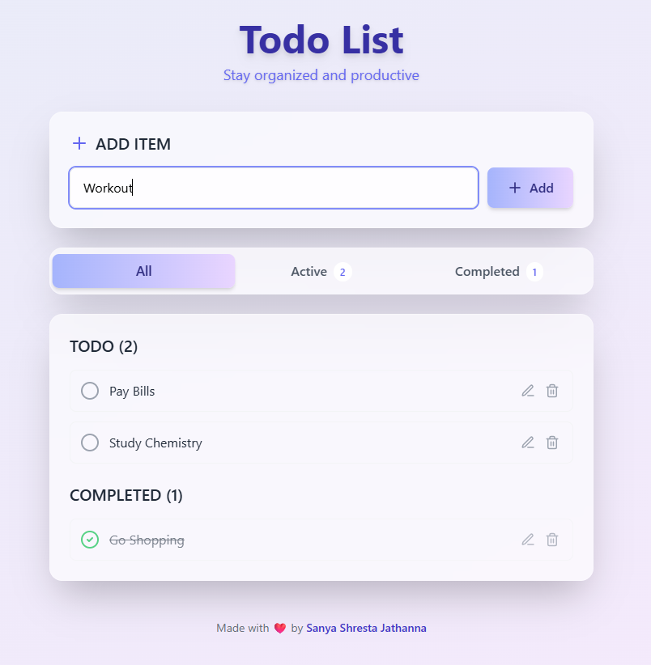

# 📝 Todo List App

An elegant and minimal **To-do List App** built with **React**, **TypeScript**, and **Tailwind CSS**. This project showcases how to use the `useEffect` hook to persist tasks using browser **localStorage**, all wrapped in a clean glassmorphic UI. 🌿

---

## 🚀 Live Demo

[](https://to-do-list-eight-peach-49.vercel.app/)
[](https://github.com/SanyaShresta25/To-Do-List)

---

## 📸 Screenshot



---

## 🛠️ Built With

[](https://react.dev)
[](https://www.typescriptlang.org/)
[](https://tailwindcss.com/)
[](https://developer.mozilla.org/en-US/docs/Web/API/Window/localStorage)

---

## ✨ Features

* 🆕 Add New Task with an input + "Add" button
* 📋 Display all tasks grouped by status
* ✅ Mark tasks as completed (with strikethrough)
* 🗑️ Delete tasks easily
* 💾 Tasks saved with `localStorage` — no backend needed
* 🌈 Soft UI with glassmorphic effect

---

## 🔍 What I Learned

* Using `useEffect` for:

  * Loading tasks on initial mount
  * Syncing updates to browser storage
* Handling controlled inputs in React
* Styling beautiful layouts using Tailwind CSS
* Managing clean state and UI flow with TypeScript

---

## 📚 Topics Covered

* React Hooks: `useEffect`, `useState`
* Controlled input forms
* LocalStorage read/write
* Component design in TypeScript
* Tailwind's glass and blur utilities

---

## 🔧 Getting Started

```bash
# Clone the repo
git clone https://github.com/SanyaShresta25/todo-app.git
cd todo-app

# Install dependencies
npm install

# Run the development server
npm run dev
```

---

## 🌱 Future Enhancements

* [ ] Add Due Dates / Reminders
* [ ] Task categories or tags
* [ ] Dark Mode toggle
* [ ] PWA for offline support
* [ ] Drag & drop task reordering

---

## 📚 Useful Resources

* [React – useEffect Docs](https://react.dev/reference/react/useEffect)
* [Tailwind CSS](https://tailwindcss.com/docs)
* [TypeScript with React](https://react-typescript-cheatsheet.netlify.app/)
* [MDN – localStorage](https://developer.mozilla.org/en-US/docs/Web/API/Window/localStorage)

---

## 👩‍💻 Author

**Sanya Shresta Jathanna**

[](https://github.com/SanyaShresta25)
[](https://www.linkedin.com/in/sanya-shresta-jathanna)
[](https://sanyashresta.netlify.app/)

---

## 🙏 Acknowledgments

* Inspired by the power of checklists and clarity
* Thanks to the React and Tailwind community for amazing tooling

---
